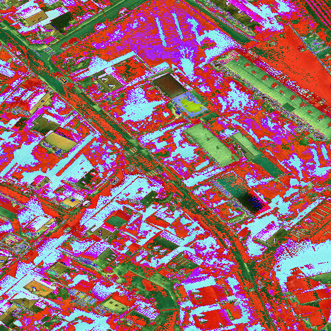
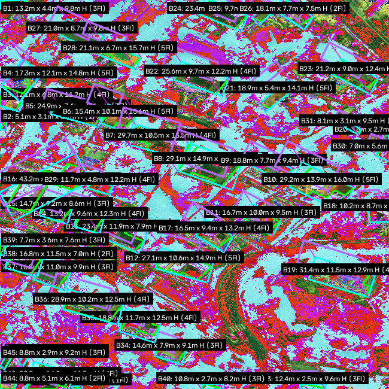

# 🏢 Satellite 3D Building Measurement System (Length, Width & Height)

An end-to-end Python system for automated 3D detection, measurement, and visualization of building dimensions (**Length**, **Width**, **Height**, **Story/Floor Count**, and **3D Footprint Volume**) in high-resolution satellite imagery (SpaceNet 2 dataset).

---

## 🌟 Key Features

- **Automated Geometry Extraction**: Parses building polygon coordinates from WKT (Well-Known Text) annotations.
- **Minimum Bounding Box Measurement**: Computes oriented minimum area rectangles (`cv2.minAreaRect`) to determine physical length and width independent of building orientation.
- **Physics-Based & Morphological Height Estimation**: Combines local shadow displacement gradient analysis along the solar illumination vector with morphological footprint scaling models to calculate building height ($H_{\text{m}}$).
- **Floor Count & 3D Volumetric Metrics**: Estimates total story count ($F$) and computes complete 3D structure volume ($V_{\text{m}^3}$).
- **Physical Scale Conversion**: Translates pixel dimensions into ground meters using Ground Sample Distance ($\text{GSD} = 0.30\text{ m/pixel}$).
- **High Performance & Sub-Crop Optimization**: Fast localized sub-crop processing delivering calculation speeds of **~1.75 ms per building**.
- **Exact Area Calculation**: Calculates true building polygon footprint area ($\text{m}^2$) using Shapely geometry engine.
- **3D Wireframe Spatial Visualization**:
  - Overlays 2D ground footprint polygon outlines (green).
  - Draws minimum area oriented bounding boxes (cyan).
  - Renders 3D isometric wireframe prism projections (magenta/pink extrusions) showing true spatial elevation.
  - Generates a 4-panel analytical comparison dashboard including distribution bar charts of building height vs 3D volume.

---

## 📸 Output & Visual Results

### 1. 4-Panel Analytics & 3D Extrusion Dashboard Plot


### 2. Output Image Breakdown

| Original Satellite Image | Building Ground Footprints | 3D Measured Output (L x W x H + Wireframes) |
|:-----------------------:|:-------------------------:|:------------------------------------------:|
|  |  |  |

---

## 📊 Measurement Sample Output

```text
==================================================
SpaceNet 2 Building 3D Dimension Measurement
 (Length, Width, Height, Floors & Volume)
==================================================
[Loaded Image]: RGB-PanSharpen_AOI_3_Paris_img485.tif (ID: AOI_3_Paris_img485)
[Building Count]: 45 building footprints found.

--- Building 3D Measurement Results ---
Building #1:
  Length   : 44.13 px  -> 13.24 m
  Width    : 14.62 px  -> 4.39 m
  Height   : 28.32 px  -> 8.50 m (3 Floors)
  Footprint: 327.56 px² -> 29.48 m²
  3D Volume: 250.51 m³
  ----------------------------------------
Building #2:
  Length   : 16.95 px  -> 5.08 m
  Width    : 10.24 px  -> 3.07 m
  Height   : 17.51 px  -> 5.25 m (2 Floors)
  Footprint: 86.78 px² -> 7.81 m²
  3D Volume: 41.01 m³
  ----------------------------------------
Building #16:
  Length   : 144.11 px  -> 43.23 m
  Width    : 53.43 px  -> 16.03 m
  Height   : 38.73 px  -> 11.62 m (4 Floors)
  Footprint: 3852.83 px² -> 346.75 m²
  3D Volume: 4029.45 m³
  ----------------------------------------
[Calculated & Rendered 44 Buildings in 77.0ms] (1.75ms/building)
```

---

## 🛠️ Installation & Setup Steps

### Prerequisites
- Python 3.8 or higher
- Git

### Step 1: Clone the Repository
```bash
git clone https://github.com/asheeshral/building-measurement.git
cd building-measurement
```

### Step 2: Create a Virtual Environment (Optional but Recommended)
```bash
# On Windows
python -m venv venv
venv\Scripts\activate

# On Linux/macOS
python3 -m venv venv
source venv/bin/activate
```

### Step 3: Install Required Dependencies
```bash
pip install -r requirements.txt
```

---

## 🚀 How to Run

1. Place your SpaceNet 2 dataset directory or satellite `.tif` images & `.csv` WKT solution files in the dataset path.
2. Run the 3D measurement script:
```bash
python measure_building.py
```
3. All output images and multi-panel comparison plots will be saved inside the `images/` directory automatically.

---

## 🧮 How It Works

1. **Polygon Parsing**: Loads WKT polygon vertices from `summaryData/AOI_3_Paris_Train_Building_Solutions.csv`.
2. **Oriented Footprint Geometry**:
   $$\text{Length}_{\text{m}} = \max(\text{side}_1, \text{side}_2) \times \text{GSD}$$
   $$\text{Width}_{\text{m}} = \min(\text{side}_1, \text{side}_2) \times \text{GSD}$$
3. **Footprint Area**:
   $$\text{Area}_{\text{m}^2} = \text{Polygon Area}_{\text{px}} \times \text{GSD}^2$$
4. **Hybrid Height Estimation**:
   - **Geospatial Solar Vector Math**: Converts solar azimuth ($\theta_{\text{az}}$) to pixel space vectors ($dx_{\text{shadow}} = -\sin(\theta_{\text{az}}), dy_{\text{shadow}} = \cos(\theta_{\text{az}})$).
   - **Shadow Physics**: Computes ground shadow length $S_{\text{m}} = L_{\text{shadow\_px}} \times \text{GSD}$, deriving height $H_{\text{shadow}} = S_{\text{m}} \cdot \tan(\theta_{\text{solar\_elevation}})$.
   - **Morphological Story Model**: Fuses ground area scaling and aspect ratio to estimate story count ($F$) and structural height ($H_{\text{structural}} = F \times h_{\text{floor}}$).
5. **3D Volume Calculation**:
   $$\text{Volume}_{\text{m}^3} = \text{Area}_{\text{m}^2} \times \text{Height}_{\text{m}}$$
6. **Isometric 3D Wireframe Extrusion**: Projects roof polygon geometry along vertical height displacement vectors and overlays label cards detailing $L \times W \times H$, floor count, and volumetric metrics.

---

## 📄 License
MIT License
